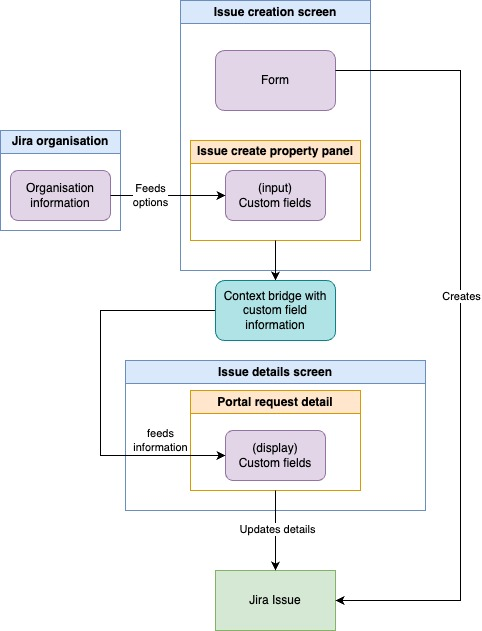

# Reactive Jira Tickets setup guide
An application that dynamically generates and updates forms based on a client's privileges, ensuring they only have access to information they are authorized to view.
## Build, run, deploy
- Install **Forge** according to the [Jira Guide](https://developer.atlassian.com/platform/forge/getting-started/)
- Run **npm run build** in both folders ***PortalRCPP*** and ***PortalRD***
- Run **forge deploy** in the main folder of the whole app to deploy
- Run **forge install (-e development/production)** in the main folder of the whole app to install in the Jira Enviroment ("-e" to chose between dev/prod) 
## Required settings
#### Settings that are rquired for the view of all modules
- Enable the detailed organisation module \
  Path: Project Settings --> Features --> Customer and organization       profiles 
## Creation and setup of custom fields
Add Custom fields to be modified by the app \
  Path: Project Settings > Fields > Edit Pencil Icon > Custom Fields > Create Custom Field 
##### Custom fields required:
  - **App** - Short Text Field
  - ⁠**Module** - Short Text Field
  - ⁠**App Version** - Short Text Field
##### [Finding custom field id](https://confluence.atlassian.com/jirakb/how-to-find-any-custom-field-s-ids-744522503.html) 
### Code changes required 
- It is required to update the target fields in the customFields.js file of the project
- Api Credentials have to be updated in the customFields.js [Generating api key](https://id.atlassian.com/manage-profile/security/api-tokens.)

## Setting up organisations 
Creating custom organistaions with the information necessary to work with the plugin \
 Toggle: Organisations > Edit details > Custom Fields 
####
- **Apps** - comma separated list
- **Modules** - comma separated list
# Technical diagram of the plugin

